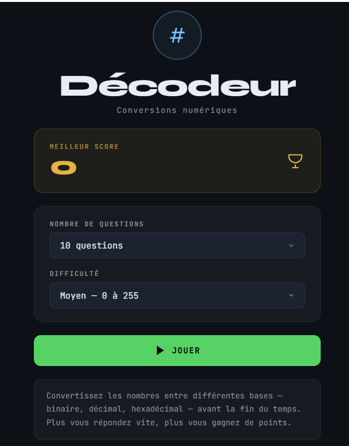
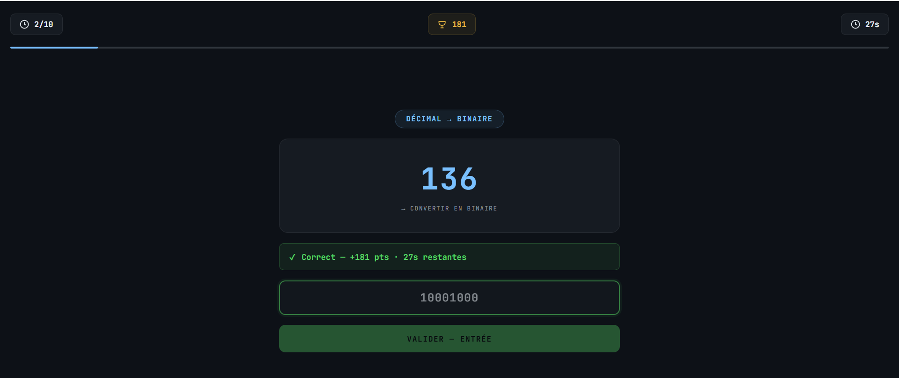

<div align="center">

```
██████╗ ███████╗ ██████╗ ██████╗ ██████╗ ███████╗██╗   ██╗██████╗
██╔══██╗██╔════╝██╔════╝██╔═══██╗██╔══██╗██╔════╝██║   ██║██╔══██╗
██║  ██║█████╗  ██║     ██║   ██║██║  ██║█████╗  ██║   ██║██████╔╝
██║  ██║██╔══╝  ██║     ██║   ██║██║  ██║██╔══╝  ██║   ██║██╔══██╗
██████╔╝███████╗╚██████╗╚██████╔╝██████╔╝███████╗╚██████╔╝██║  ██║
╚═════╝ ╚══════╝ ╚═════╝ ╚═════╝ ╚═════╝ ╚══════╝ ╚═════╝ ╚═╝  ╚═╝
```

*Convertissez des nombres entre bases — avant la fin du temps.*


<br/>

<p align="center">
  
  
</p>

<p align="center">
  
</p>

</div>

---

## Principe

À chaque question, un nombre s'affiche dans une base — binaire, décimal ou hexadécimal.  
Convertissez-le dans la base demandée avant la fin du temps.  
Plus vous répondez vite, plus vous gagnez de points.

---

## Conversions

| Base source | Base cible |
|---|---|
| Binaire | Décimal |
| Décimal | Binaire |
| Hexadécimal | Décimal |
| Décimal | Hexadécimal |
| Hexadécimal | Binaire |
| Binaire | Hexadécimal |

---

## Difficulté

| Niveau | Plage | Temps | Conversions |
|---|---|---|---|
| Facile | 0 – 31 | 45 s | 2 types |
| Moyen | 0 – 255 | 60 s | 4 types |
| Difficile | 0 – 4095 | 90 s | 6 types |

---

## Fonctionnalités

- 3 niveaux de difficulté et 4 longueurs de session (5, 10, 15, 20 questions)
- Score dynamique — bonus de vitesse sur chaque bonne réponse
- Meilleur score sauvegardé localement
- Récapitulatif détaillé en fin de partie
- Contrôles clavier natifs — `Entrée` pour valider
- Design sombre responsive, sans dépendance externe

---

## Utilisation

Ouvre `Decodeur/index.html` directement dans un navigateur — aucune installation requise.

---

## Structure

```
Decodeur/
├── index.html   # Trois écrans — menu, jeu, résultats
├── style.css    # Thème terminal sombre, animations
└── script.js    # Moteur de jeu, conversions, timer
```
